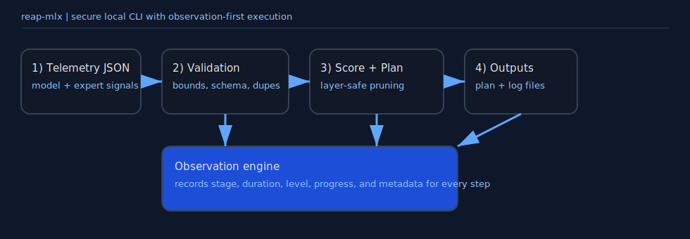

# reap-mlx

`reap-mlx` is a stackable MLX-first REAP toolkit with three concrete stages:

1. `collect` real routing telemetry (`g_j(x)`, `||f_j(x)||`, and `g_j(x) * ||f_j(x)||`)
2. `run` REAP saliency planning
3. `apply` structural expert pruning on MLX checkpoints

It also emits a full JSONL observation log for every `run`.



## Install

```bash
pnpm install
pnpm build
node dist/cli/index.js help
```

## REAP alignment status

Current core behavior is close to Cerebras REAP on the pruning path:

- REAP saliency uses per-expert mean of `g_j(x) * ||f_j(x)||` over active tokens
- optional top-k weight renormalization in collector (`--renorm-topk`)
- per-layer pruning ratio (layer-local `floor(layer_experts * ratio)`)
- min experts per layer safety floor
- structural MLX checkpoint patching (`apply`) for selected layers

Remaining deltas vs Cerebras repo are mostly around full benchmark harness and architecture coverage breadth.

## Commands

- `collect`: extract REAP telemetry from a real MLX model
- `run`: compute pruning plan from telemetry
- `apply`: apply pruning plan to MLX checkpoint
- `observe`: summarize observation log
- `init`: generate synthetic telemetry for tests

---

## Telemetry contract (what `run` consumes)

Minimal fields per expert for strict REAP mode:

```json
{
  "layer": 0,
  "expert": 12,
  "activeTokenCount": 42,
  "weightedActivationNormSum": 3.91
}
```

Recommended full fields:

```json
{
  "layer": 0,
  "expert": 12,
  "activeTokenCount": 42,
  "tokenCount": 42,
  "gateValueSum": 9.33,
  "activationNormSum": 18.71,
  "weightedActivationNormSum": 3.91,
  "averageGateValue": 0.2221,
  "averageActivationNorm": 0.4455,
  "activationScore": 0.0931
}
```

`run --no-legacy` enforces REAP saliency fields and disables legacy fallback.

---

## How saliency is computed

Priority order per expert:

1. `weightedActivationNormSum / activeTokenCount` (primary)
2. `averageGateValue * averageActivationNorm`
3. `(gateValueSum / activeTokenCount) * (activationNormSum / activeTokenCount)`
4. legacy fallback (`activationScore`) only if legacy mode is enabled

This score is used to rank experts ascending (lowest = prune first).

---

## Pruning policy

For each layer independently:

- `requested = floor(numExpertsInLayer * targetRatio)`
- `target = min(requested, numExpertsInLayer - minExpertsPerLayer)`
- prune lowest-saliency `target` experts

This matches REAP-style layer-local pruning behavior better than global pooling.

---

## Collect telemetry from a real MLX model

```bash
node dist/cli/index.js collect \
  --model /path/to/mlx-model \
  --output ./tmp \
  --prompt "Explain sparse MoE routing in one sentence." \
  --max-tokens 64 \
  --layers 0-3 \
  --renorm-topk
```

Outputs a telemetry JSON file under `--output`.

---

## Build pruning plan

```bash
node dist/cli/index.js run \
  --model ./tmp/telemetry-xxxx.json \
  --output ./tmp/out \
  --ratio 0.05 \
  --calibration 2 \
  --min-experts 1 \
  --no-legacy
```

Produces:

- `./tmp/out/pruning-plan.json`
- `./tmp/out/observation.log`

---

## Apply plan to an MLX checkpoint

```bash
node dist/cli/index.js apply \
  --model /path/to/mlx-model \
  --plan ./tmp/out/pruning-plan.json \
  --output ./tmp/pruned
```

Dry-run validation:

```bash
node dist/cli/index.js apply \
  --model /path/to/mlx-model \
  --plan ./tmp/out/pruning-plan.json \
  --output ./tmp/pruned \
  --dry-run
```

---

## Observability

Summarize run events:

```bash
node dist/cli/index.js observe --file ./tmp/out/observation.log --json
```

Recorded stages:

- `bootstrap`
- `load_model`
- `validate`
- `score_experts`
- `plan_pruning`
- `write_output`
- `complete`

---

## Real-model example result (local)

On `qwen1.5-moe-a2.7b-chat-4bit` with `layers 0-3`, `ratio 0.05`, strict mode:

- telemetry experts: `240` (`60` per layer)
- pruned experts: `12` (`3` per layer)
- structural apply: patched layers `0..3`, experts `60 -> 57` for patched layers

---

## Security behavior

- path traversal blocked for output writes
- symlink reads refused for input files
- bounded safe file reads
- atomic writes for plan and logs
- restrictive file/dir permissions where supported

## Verify

```bash
pnpm verify
```
